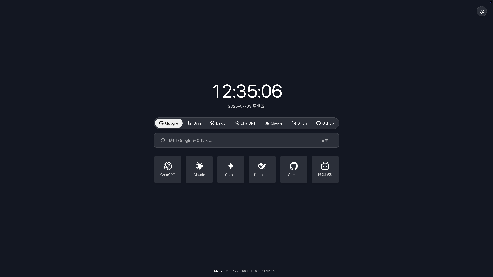
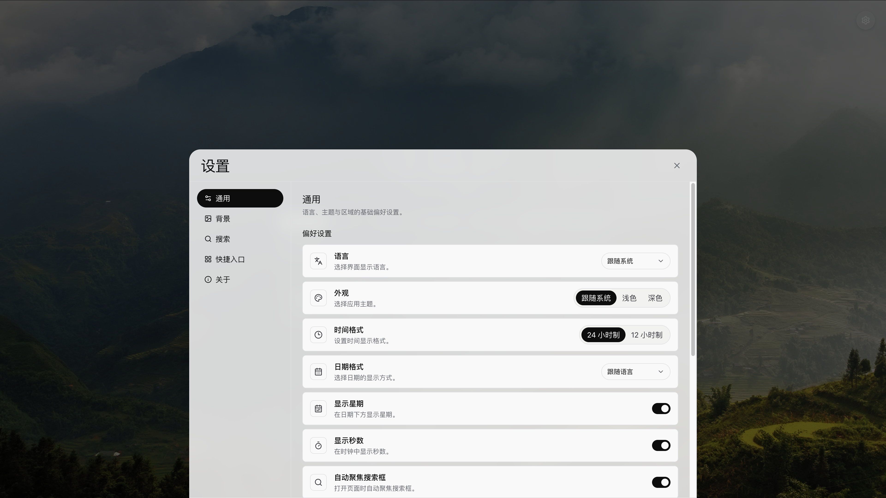
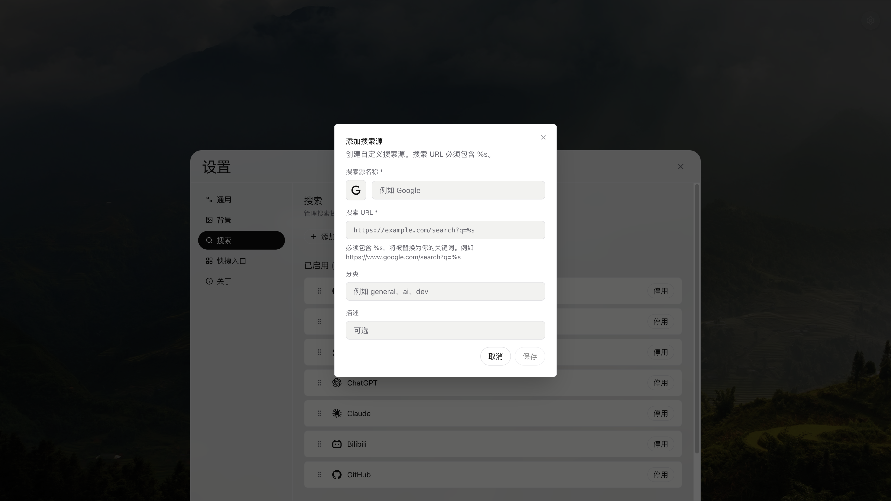
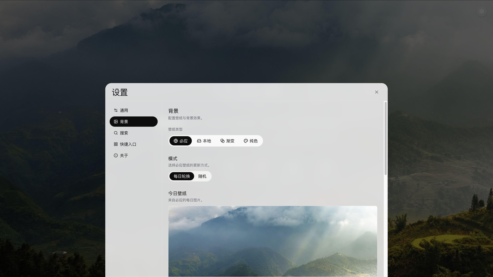
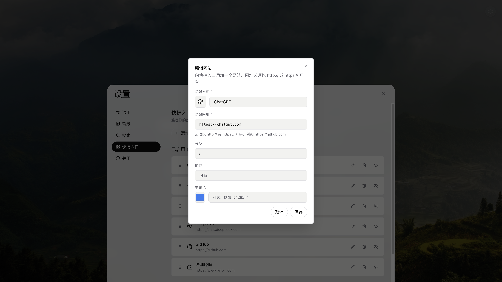

<div align="center">

# KNav

现代、快速、可定制的浏览器起始页。

[](./LICENSE)
[](./package.json)
[](https://react.dev)
[](https://www.typescriptlang.org)
[](https://vite.dev)

</div>

---

## 📖 项目简介

KNav 是一个纯前端的浏览器新标签页起始页，把时钟、搜索、快捷入口和壁纸整合到一个干净的页面上。

---

## ✨ 功能特性

- 🔍 **多搜索引擎** —— 内置多个搜索源，支持新增、编辑、删除、拖拽排序与启用/禁用
- 🕘 **搜索历史** —— 记录最近搜索，支持查看与一键清空
- ⏰ **数字时钟** —— 支持 12/24 小时制、星期显示、秒钟显示
- 🎨 **多种壁纸** —— 纯色、渐变、Bing 每日/随机、本地图片四种模式
- 🖌️ **渐变编辑器** —— 支持 HEX / RGB 取色、多色停靠点与方向调整
- 👓 **背景可读性** —— 根据壁纸自动调整蒙层、文字颜色与毛玻璃效果
- ⭐ **快捷入口** —— 预设 + 自定义，支持 Iconify 图标、拖拽排序与启用/禁用
- 🌍 **多语言** —— 简体中文 / English，可跟随系统
- 🌗 **主题切换** —— 深色 / 浅色 / 跟随系统
- 📤 **配置导入导出** —— 一键备份与恢复，包含本地上传的壁纸
- � **本地存储** —— 数据保存在浏览器本地，纯前端离线运行
- � **响应式布局** —— 适配桌面与移动端

---

## 📸 效果预览

### 首页

| Bing 壁纸 | 本地壁纸 | 纯色壁纸 |
| :---: | :---: | :---: |
|  |  |  |

### 设置中心

| 通用设置 | 搜索设置 |
| :---: | :---: |
|  |  |

| 壁纸设置 | 快捷入口 |
| :---: | :---: |
|  |  |

---

## 🧩 技术栈

| 分类 | 技术 |
| --- | --- |
| 框架 | React 19 |
| 构建 | Vite 6 |
| 语言 | TypeScript 5 |
| 样式 | Tailwind CSS 4 |
| UI 基础组件 | Radix UI |
| 图标 | Iconify + Lucide |
| 状态管理 | Zustand |
| 路由 | React Router 7 |
| 拖拽排序 | dnd-kit |
| 虚拟列表 | TanStack Virtual |
| 提示 | Sonner |
| 国际化 | i18next + react-i18next |
| 存储 | IndexedDB + localStorage |

---

## 🚀 快速开始

> 项目使用 [pnpm](https://pnpm.io/) 作为包管理器。

### 克隆项目

```bash
git clone https://github.com/kindyear/KNav.git
cd KNav
```

### 安装依赖

```bash
pnpm install
```

### 启动开发服务器

```bash
pnpm dev
```

### 构建生产版本

```bash
pnpm build
```

### 本地预览构建产物

```bash
pnpm preview
```

其他脚本：

```bash
pnpm lint        # 代码检查
pnpm format      # 代码格式化
pnpm typecheck   # 类型检查
```

---

## 📂 项目结构

```
src/
├── app/          # 应用根组件
├── assets/       # 静态资源
├── components/   # UI 组件（首页、设置、图标系统、基础组件）
├── config/       # 默认配置与常量（设置、壁纸、可读性等）
├── features/     # 业务功能模块（时钟、搜索、快捷入口）
├── hooks/        # 通用 React Hooks
├── layouts/      # 页面布局
├── lib/          # 底层库（配置导入导出、i18n、工具）
├── locales/      # 多语言资源（zh-CN / en-US）
├── providers/    # 全局 Provider 与副作用
├── router/       # 路由定义
├── services/     # 数据与业务服务（壁纸、主题、可读性等）
├── stores/       # Zustand 状态仓库
├── styles/       # 全局样式与设计 Token
├── types/        # TypeScript 类型定义
└── utils/        # 工具函数
```

---

## ⚙️ 配置说明

KNav 无需任何环境变量或后端配置即可运行，所有用户配置均在界面「设置」中完成，并持久化到浏览器本地。

| 配置项 | 说明 |
| --- | --- |
| 通用 | 语言、主题、时间格式、日期格式、星期与秒钟显示、自动聚焦搜索、Enter 打开方式 |
| 搜索 | 搜索源的增删改、排序、启用/禁用 |
| 壁纸 | 纯色 / 渐变 / Bing / 本地图片，以及背景可读性相关选项 |
| 快捷入口 | 图标、名称、链接的增删改与排序 |
| 数据 | 导入配置、导出配置、恢复默认、清空本地数据 |

导出的配置文件采用统一的版本化格式，包含全部用户配置（含本地上传的壁纸），可在其他设备上完整导入恢复。

### 关于 Bing 壁纸的代理

Bing 的图片接口不返回 CORS 头，浏览器无法直接请求，因此项目通过同源路径 `/bing-api` 转发到 `https://www.bing.com`：

- **开发环境**：已在 [`vite.config.ts`](./vite.config.ts) 的 `server.proxy` 中配置，开箱即用。
- **生产环境**：需要在你的反向代理（如 Nginx、CDN）中把 `/bing-api` 转发到 `https://www.bing.com`，否则 Bing 壁纸会请求失败。

---

## ❓ 常见问题

**部署后 Bing 壁纸请求 404？**

Bing 壁纸依赖 `/bing-api` 代理。该代理仅在开发服务器中生效，生产环境需要在反向代理里手动配置转发（见上文「关于 Bing 壁纸的代理」）。

**如何修改默认搜索引擎？**

进入「设置 → 搜索」，可以新增自定义搜索源、编辑现有搜索源、拖拽排序，并启用或禁用任意搜索源。

**数据保存在哪里？会上传吗？**

不会上传。本地上传的壁纸（二进制）保存在 IndexedDB，其余配置（通用设置、搜索源、快捷入口、搜索历史等）保存在 localStorage，全部数据仅存在于当前浏览器。

**换电脑或换浏览器后如何迁移配置？**

在「设置 → 数据」中导出配置文件，然后在新环境导入即可，导出内容包含本地上传的壁纸。

---

## 📄 License

本项目采用 **KNav Community License Version 1.0**。

- ✅ 允许个人、教育及非商业用途的使用、复制、修改与分发
- ✅ 允许 Fork 与二次修改（需保留原始版权声明并注明改动）
- ❌ 未经授权禁止任何形式的商业用途

完整条款见 [LICENSE](./LICENSE)。如需商业授权，请联系 [me@kindyear.cn](mailto:me@kindyear.cn)。
